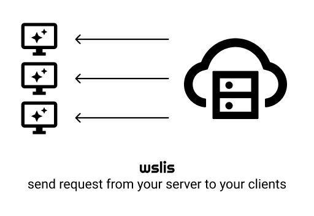

[](http://godoc.org/github.com/guillermo/wslis)


# What it does?

Package *wslis* allows a server to create connections to clients.

*wslis* allows a server to create connections to clients. For that, clients
previously stablish a connection to the server through websockets. Once the
websocket connection is stablish, the connection is multiplexed through
[yamux](https://github.com/hashicorp/yamux) so several connections can go
through the same http stream.


# Usage

## Client
```go
lis, err := wslis.DialAndListen("ws://localhost:9090", http.Header{"DeviceId": []string{"123"}})
if err != nil {
    panic(err)
}

// Let's have an echo server
conn, err := lis.Accept()
if err != nil {
    panic(err)
}

buf := make([]byte, 1024)
n, err := conn.Read(buf)
if err != nil {
    panic(err)
}
conn.Write(buf[:n])
conn.Close()
    
```


## Server

```go
log.Fatal(wslis.ListenAndServe("localhost:9090", wslis.EndpointHandlerFunc(func(d *Dialer) {
    id := d.Header.Get("DeviceId")
    log.Printf("Device %s connected\n", id)

    // We open a new connection to the client as soon as we get the connection
    conn, err := d.Dial()
    if err != nil {
        panic(err)
    }

    // We say hi
    conn.Write([]byte("hola"))

    // And we expect a hi back
    n, err := conn.Read(buf)
    if err != nil {
        panic(err)
    }

    if buf[:n] != "hola" {
        panic("That's sad")
    }
})))
```


# Why?

*wslis* comes from the needs of delegatescreen.com that mainly display webpages
in office dashboards. The most common operations are: Set the web page to
display, and get a screenshot of the current page. This operations have to be
syncronous, and completes as fast as possible.

This lead us to the following desing considerations:

* Request-Response paradigm.
* It works over http, so edges, load balancers and other network
components work out of the box.

And this are the options considered.

* ZeroMq, Mqtt or most iot platforms are pub sub based. So even if most of them can work over http, we will need to abstract some kind of request/response ciclye.
* Signaling where the server sends a signal (kind of request) to the client,
and the client initiates an http request. For signaling we considered: longpush,
server-sent-events, http2 push . This option was discarded
to remove the need of designing a signaling mecanish, and the added
complication of matching signals to client/requests.
* connect the clients to vpns through wireguard. As clients can run on
windows/mac/linux this will imply the automation of all the configuraiton in
three ooss, and maintain that over time. Also a missconfiguration may brick
the computer.

* ssh over http. This will give the server control over the clients to run
any commands. Even if this might be flexible enough, a compromise server could
infect a client and access client network.


